# flareover

**Move your site off the orange cloud onto your own EU servers — without changing how it behaves.**

[](https://github.com/fabriziosalmi/flareover/actions/workflows/ci.yml)
[](https://github.com/fabriziosalmi/flareover/releases)
[](go.mod)
[](LICENSE)

<p align="center"></p>

Leaving the big managed edge means rebuilding, by hand, everything the dashboard quietly does for
you: DNS, TLS certificates, redirects, firewall/WAF rules, caching — and hoping you didn't miss
something that silently breaks the site.

`flareover` does that rebuild for you. Point it at a Cloudflare zone; it reads every setting and
generates the equivalent configuration for an open-source, self-hosted stack (Caddy, PowerDNS,
CertMate, …) on EU infrastructure. Its one rule: **never emit config that silently changes behavior.**

- Where it can prove an exact equivalent, it applies it.
- Where a choice is genuinely ambiguous, it asks you one yes/no.
- Where nothing maps faithfully, it flags the item for you — and **never guesses**.

That last part is the whole point: a migration you can trust, because the tool is honest about exactly
what it can and can't carry over.

**Contents:** [The contract](#the-contract-no-silent-surprises) · [How it works](#how-it-works--five-phases) · [Target stack](#target-stack-eu-sovereign) · [Install](#install) · [Usage](#usage) · [Status](#status) · [Architecture](docs/architecture.md) · [Contributing](CONTRIBUTING.md)

## The contract: no silent surprises

Every setting on the source gets exactly one verdict:

| Verdict | Meaning |
|---------|---------|
| **AUTO** | There's a proven exact equivalent on the target → config is generated automatically. |
| **ASK** | A faithful mapping exists, but one detail is genuinely ambiguous → you answer one yes/no (saved in `decisions.lock`), then it's treated as AUTO. |
| **MANUAL** | Nothing maps faithfully (Workers code, ML bot-scoring, proprietary DDoS) → documented and left for you, never guessed. |

Behavior-changing configuration is emitted **only** for AUTO and answered-ASK items — everything else
is surfaced, never silently applied. Classification and artifact generation are a **pure function** of
`snapshot + decisions.lock`: run it twice, get byte-identical config (this is golden-tested), so the
result is reviewable in git before anything goes live. (Runtime state a *target* assigns later — e.g.
a MinIO lifecycle-rule id — is outside that function and noted where it differs.)

## How it works — five phases

```
assess → prepare → present → execute → guard
```

1. **Assessment** (`assess`) — read-only extract of the source zone → provider-agnostic intent model
   (CF-IR) → classify every element AUTO/ASK/MANUAL. Output: an honest coverage report (+ cost).
2. **Preparation** (`prepare`) — resolve ASK items; generate artifacts; auto-provision a **staged** target.
3. **Presentation** (`present`) — parity gate: probe the live edge vs the staged edge and diff
   status/redirects/headers/body. HARD divergences block; SOFT ones are surfaced.
4. **Execution** (`execute`) — gated cutover, orchestrated live up to the DNS flip. Requires explicit confirmation.
5. **Failguards** (`guard`) — health monitoring, automatic rollback/failover, fail-closed egress,
   idempotent re-runs.

## Target stack (EU-sovereign)

| Concern | Tool |
|---------|------|
| Authoritative DNS | PowerDNS self-hosted (zone + records + DNSSEC → DS for the registrar), or a managed EU provider via `--dns`: **bunny.net**, **Scaleway**, **OVHcloud**, **Gandi** or **Leaseweb** (`provision --dns <id>`) |
| Reverse proxy / CDN / TLS | Caddy (native ACME, HTTP/3) |
| Edge cache | souin (Caddy module) |
| WAF | caddy-waf (OWASP/rate-limit/IP·ASN·country/blocklists) |
| Certificates | CertMate — DNS-01, wildcard, Let's Encrypt or **Actalis** (EU CA) |
| Object storage (R2/S3 →) | MinIO self-hosted, or managed EU S3 — **Scaleway** (`storage --dest scaleway`) / **OVHcloud** (`--dest ovh`) — buckets + versioning + lifecycle + CORS; rclone data copy |
| Egress shield (optional) | secure-proxy-manager (default-deny + allowlist, fail-closed) |
| Sovereign origin link | WireGuard mesh (replaces the Cloudflare Tunnel; origin stays inbound-free) |
| Blocklists | blacklists feeds |
| Landing zone | bare-metal / Proxmox, or any EU provider — `flareover providers` |

Every target is tagged with its jurisdiction so the migration provably stays EU-scoped. Edge providers
carry an honest **sovereignty tier**: EU-owned operators (Hetzner, OVH, Contabo, Aruba, Scaleway) are
labelled sovereign; a hyperscaler's EU region (AWS/GCP/Azure in Milan) is offered too, but labelled for
what it is — EU *residency* under a US operator (CLOUD Act reach), **never** "sovereign". The engine
never touches your source provider or your registrar — the DS publish and the final NS move stay
explicit human steps.

> **Already behind a Cloudflare Tunnel?** The lowest-risk path is to keep your origin exactly where
> it is and just re-tunnel it: flareover stands up your own edge node(s) and a WireGuard tunnel, and
> the origin only swaps `cloudflared` for `wg-quick`. Add `--mesh-edge` (repeat it for an HA edge
> front). See [docs/scenario-edge-mesh.md](docs/scenario-edge-mesh.md).

## Install

```bash
# macOS (Homebrew)
brew install fabriziosalmi/flareover/flareover

# Linux/macOS — verified installer (downloads the release for your OS/arch, checks its sha256)
curl -fsSL https://raw.githubusercontent.com/fabriziosalmi/flareover/main/install.sh | sh

# …or from source (single static binary, pure Go, zero external deps)
go install github.com/fabriziosalmi/flareover/cmd/flareover@latest
```

Building from source requires **Go 1.25+**. Release binaries (linux/macOS/windows · amd64/arm64) ship
with an SBOM and a `checksums.txt` **signed keyless via Sigstore/cosign** — verify it with the command
in each release's notes. `flareover version` prints the build tag.

## Usage

```bash
flareover <phase> [args]
```

| Phase | What it does |
|-------|--------------|
| `zones` | List every zone the read-only token can see. |
| `extract <domain\|zone-id>` | Read a live Cloudflare zone (read-only API) into a snapshot JSON. |
| `assess <snapshot.json>` | Classify into an AUTO/ASK/MANUAL coverage report (`--md`, `--json`, `--html`). |
| `resolve <snapshot.json>` | Walk the ASK questions into a `decisions.lock` (`--defaults`, `--merge`). |
| `cost <snapshot.json>` | Cloudflare tier/add-on cost vs a flat EU stack (`--vps <eur/mo>`). |
| `prepare <snapshot.json>` | Generate the artifacts (Caddyfile, caddy-waf rules, PowerDNS zone, egress, mesh) **plus a `MIGRATION.md` report** — a table of every Cloudflare element found and exactly what it became (1:1 AUTO / ASK / MANUAL). `--validate` proves they parse; `--edge-provider <key>` emits an edge cloud-init (and, for **Scaleway**/**OVHcloud**, a script that creates and boots the edge instance from it). |
| `doctor …` | Read-only pre-flight — every target reachable/authorized/configured? GO/NO-GO before you provision. |
| `providers` | List EU edge providers with their honest sovereignty tier (EU-owned vs US-operator/EU-region). |
| `provision …` | Stand the target up via APIs (`--pdns-url`, `--certmate-url`). |
| `present …` | Parity gate: live edge vs staged edge (`--after-addr`). |
| `execute …` | Orchestrate the phases live up to the gated cutover. |
| `storage …` | Migrate object storage → MinIO + rclone plan (`--extract-r2`, `--extract-s3`). |
| `guard --url …` | Failguards watchdog: health-watch + rollback/failover (`--on-unhealthy`, `--interval`, `--once`). |

```bash
# 1. Assess a zone snapshot into an honest coverage report
flareover assess zone.snapshot.json

# 2. Generate the target-stack artifacts for the AUTO + answered-ASK surface
flareover prepare zone.snapshot.json \
  --decisions decisions.lock --edge-ip 203.0.113.10 --ca actalis \
  --egress-deny --egress-allow api.example.com,10.0.0.0/8 \
  --mesh-edge 203.0.113.10:51820 --out ./out

# 2b. Prove the artifacts parse, and pre-flight the target before touching it
flareover prepare zone.snapshot.json --edge-ip 203.0.113.10 --out ./out --validate
flareover doctor --pdns-url http://pdns:8081 --pdns-key "$PDNS_KEY" \
  --certmate-url http://certmate:8000 --certmate-token "$CM_TOKEN" \
  --spm-url http://spm:5001 --check-caddy   # GO / NO-GO, exit 0 only when ready

# 3. Stand up the live target (PowerDNS zone + DNSSEC, CertMate wildcard via DNS-01)
flareover provision --snapshot zone.snapshot.json --decisions decisions.lock \
  --edge-ip 203.0.113.10 \
  --pdns-url http://pdns:8081 --pdns-key "$PDNS_KEY" --nameservers ns1.example.eu,ns2.example.eu \
  --certmate-url http://certmate:8000 --certmate-token "$CM_TOKEN" \
  --certmate-dns cloudflare   # pre-cutover: NS still at the source → solve DNS-01 there

# 4. Parity gate before you flip anything
flareover present --snapshot zone.snapshot.json --after-addr 203.0.113.10:443
```

`--decisions` is a JSON map of ASK question id → answer. Anything still unanswered is simply not
generated (and stays visible as ASK in `assess`) — never guessed. The default stack profile is `caddy`.

## Status

**End-to-end and proven live.** All five phases are implemented, and every target adapter has been
exercised against a **real running service**, not just mocks — each one caught real bugs a mock could
not:

| Adapter | Live proof |
|---------|-----------|
| PowerDNS | zone + rrsets + DNSSEC provisioned on a live PowerDNS |
| CertMate | a real, publicly-trusted **wildcard certificate** issued via DNS-01 |
| MinIO | full extract → generate → provision → re-extract round-trip |
| WireGuard mesh | a real encrypted edge↔origin link, origin inbound-free |
| secure-proxy-manager | generated egress script applied against the live API, state verified |

The hand-rolled protocol code (AWS SigV4, PowerDNS rrsets, WireGuard X25519 keys, CertMate DNS-01) is
verified against the real endpoints.

The free-tier WAF mainstays **are** mapped, AUTO, to caddy-waf: **country and ASN blocking**
(`block_countries` / `block_asns`, L3 source scoped) and **rate limiting** — a per-IP limit →
`rate_limit`; a rule keyed on something other than the client IP → one ASK. The one honest caveat on
rate limits is *global* counting: Cloudflare enforces a threshold across its whole anycast edge, so
several independent self-hosted edge nodes each count locally (the effective limit scales with the node
count) unless they share a counter — a distributed-systems limit, noted rather than faked.

Deliberately **out of scope** because no faithful deterministic mapping exists: geographic traffic
*steering* (sending users to different origins by region — a paid load-balancing feature, distinct from
country blocking above) and cache-hit-ratio parity — surfaced honestly, never faked.

See [`docs/deploy-hardened.md`](docs/deploy-hardened.md) for the hardened landing-zone blueprint and
the gotchas learned the hard way.

## License

Copyright (C) 2026 Fabrizio Salmi. Licensed under [AGPL-3.0-only](LICENSE) — you may use, study,
modify, and redistribute it, but network use counts as distribution, so derivative services must offer
their source under the same terms.
