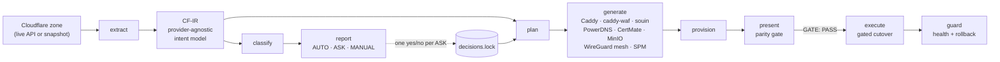
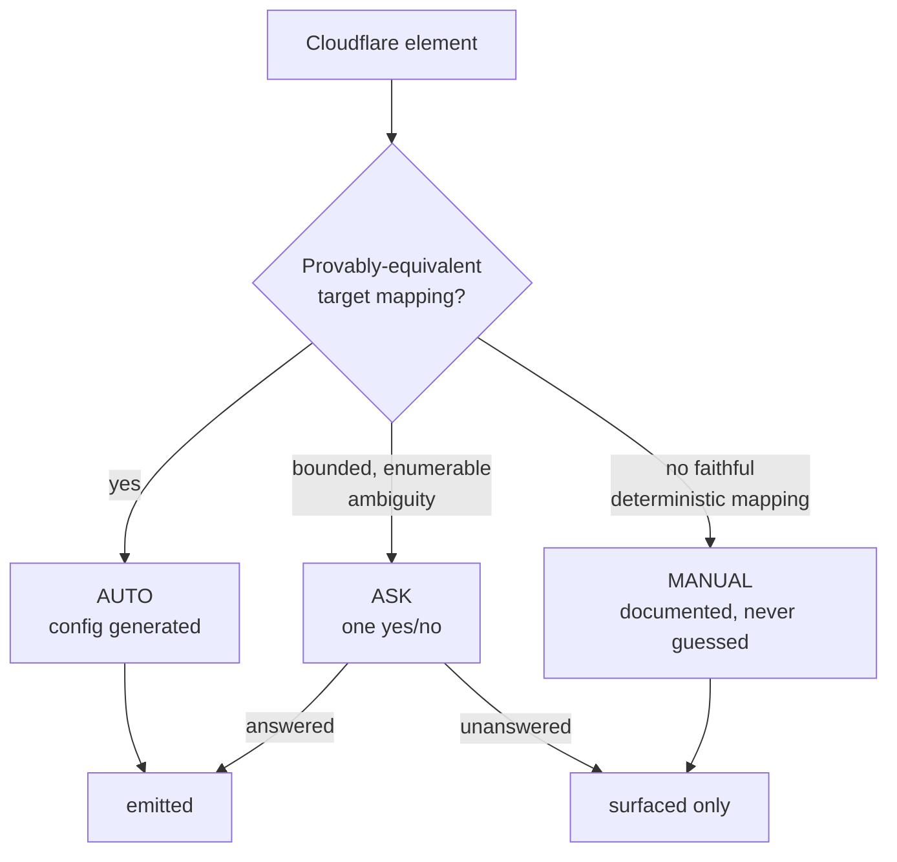
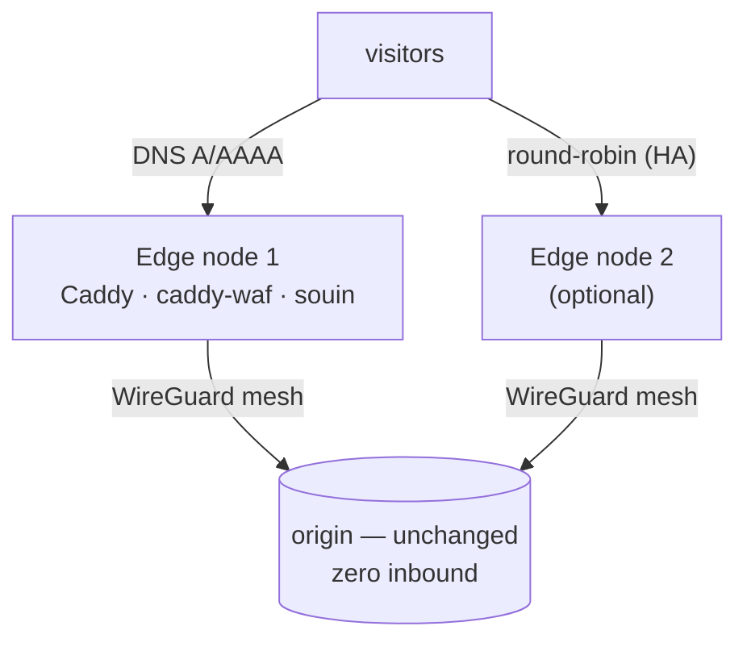

# Architecture

flareover is a pure pipeline: a Cloudflare zone goes in, a faithful EU-sovereign stack comes out, and
a verdict is attached to every element on the way. Nothing is emitted that isn't provably equivalent
(AUTO) or explicitly confirmed (answered-ASK).

## The pipeline

**Read-only up to `execute`.** `extract`, `assess`, `cost`, `prepare`, `present`, `doctor` never write
to your source or your registrar. Only `provision` (your own target, your own credentials) and the
final DNS flip in `execute` change anything, and the flip is gated on the parity result.

## The verdict — how the 0% FP contract is enforced

Every element takes exactly one path. `classify` decides the verdict; `plan` emits config for the same
surface — via the **shared `cfexpr` predicate**, so the two can never drift (a rule is only AUTO when
the generator actually produces config for it).

Classification and generation are a **pure function** of `snapshot + decisions.lock`: identical input →
byte-identical config (golden-tested). The report is reviewable in git before anything runs.

## Runtime topology it stands up

The lowest-risk shape keeps your origin exactly where it is and re-tunnels it — the origin only swaps
`cloudflared` for WireGuard. More than one edge gives an HA front (round-robin DNS + `guard`).

See [scenario-edge-mesh.md](scenario-edge-mesh.md) for the full walkthrough,
[deploy-hardened.md](deploy-hardened.md) for the hardened landing zone, and
[live-proof.md](live-proof.md) for the Tier-A runbook that proves each managed
adapter against the real provider before you trust it.

## Package map

| Package | Responsibility |
|---|---|
| `internal/cloudflare` | Read-only Cloudflare REST v4 extractor → `Snapshot` |
| `internal/ir` | CF-IR: the provider-agnostic intent model everything downstream speaks |
| `internal/cfexpr` | The **single** interpreter for CF expressions/params — shared by classify + plan so they cannot disagree |
| `internal/classify` | The verdict engine (AUTO/ASK/MANUAL) → `report.Report` |
| `internal/report` | Verdict vocabulary + the coverage report (text / Markdown / JSON / HTML) |
| `internal/plan` | Builds the deployable `ir.Plan` from snapshot + decisions — only the faithful surface |
| `internal/target/*` | Render/provision adapters: `caddy`, `caddywaf`, `certmate`, `mesh`, `spm`; DNS via `powerdns` (self-hosted) or a managed EU provider — `bunnydns`, `scalewaydns`, `ovhdns`, `gandidns`, `leasewebdns` — all sharing the BIND renderer in `zonefile` |
| `internal/objstore` | R2/S3 → self-hosted MinIO **or** managed EU S3 (Scaleway/OVH); hand-rolled SigV4 extraction, `mc`/rclone generation |
| `internal/provider` | EU edge-provider catalogue + honest sovereignty tiering + edge cloud-init (and Scaleway/OVH instance create scripts) |
| `internal/parity` | The parity prober: live edge vs staged edge, HARD/SOFT divergence |
| `internal/validate` | Proves generated artifacts parse (`caddy validate`, zone lint) |
| `internal/doctor` | Read-only pre-flight: every target reachable/authorized/configured? |
| `internal/guard` | Failguards watchdog: health-watch + rollback/failover trigger |
| `internal/runbook` | The human-facing `MIGRATION.md` report + cutover/rollback steps |
| `internal/render` · `internal/cost` · `internal/stack` | Terminal rendering · cost comparison · stack profiles |
| `cmd/flareover` | The CLI: the twelve phase verbs |

## Design invariants

- **One judge.** Whether something is faithfully translatable is decided once, in `cfexpr`, used by
  both `classify` and `plan`. No second opinion, no drift.
- **Determinism.** No wall-clock, no randomness, no network in classify/generate. Re-runs are
  byte-identical.
- **Standard library only.** The engine has zero external Go dependencies.
- **Honesty over coverage.** When equivalence can't be proven, the verdict degrades to ASK or MANUAL —
  never a hopeful AUTO.
